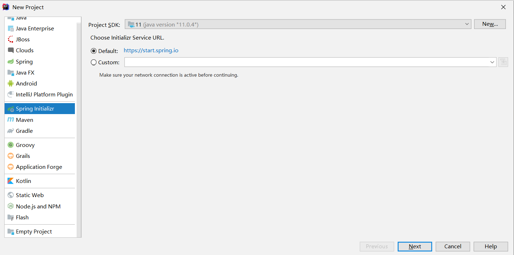
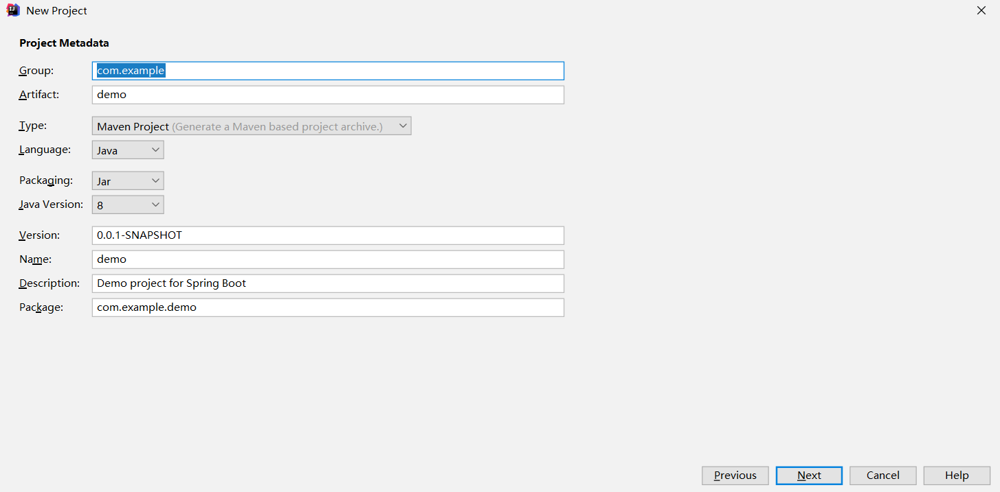
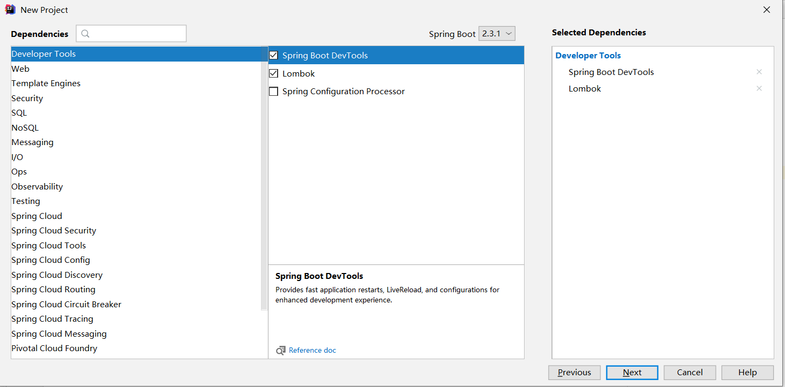

# Spring Setup

## Initialization

With Intellij, we can simply initialze it in **File/New/Project**.







Then if we can run it successfully, there will be a line:
```
Tomcat started on port(s): 8080 (http) with context path ''
```

### Ports

Consider IP address is the address of our PC, and it is like the address of our apartment. Port number in our PC is like room number in our apartment.
